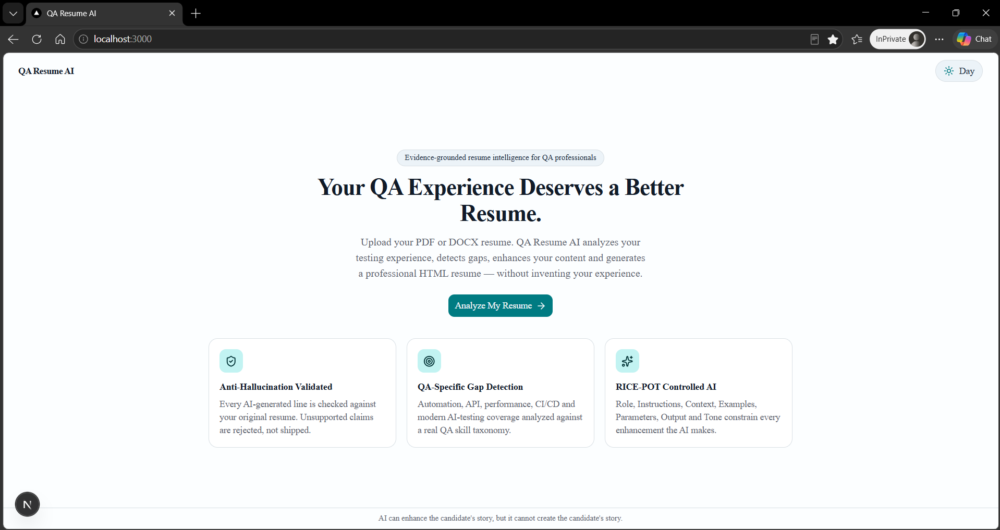
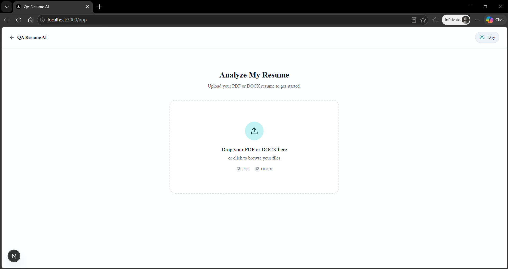
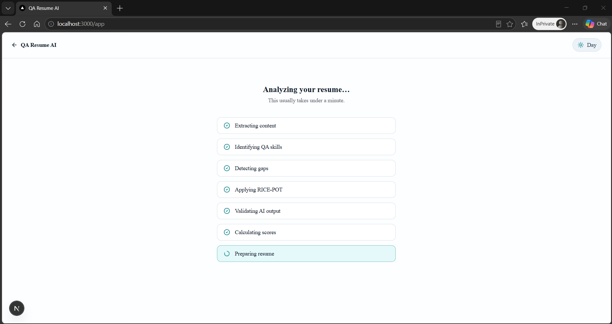
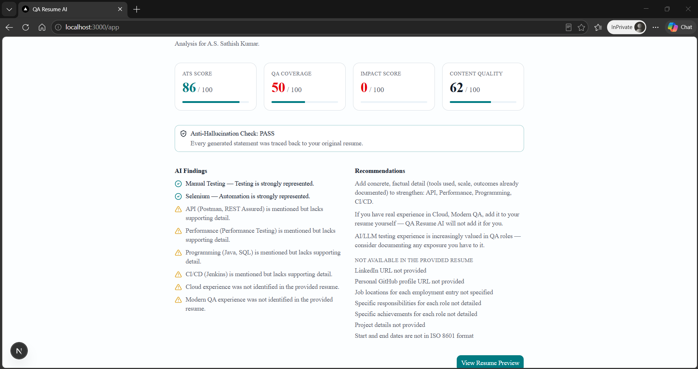
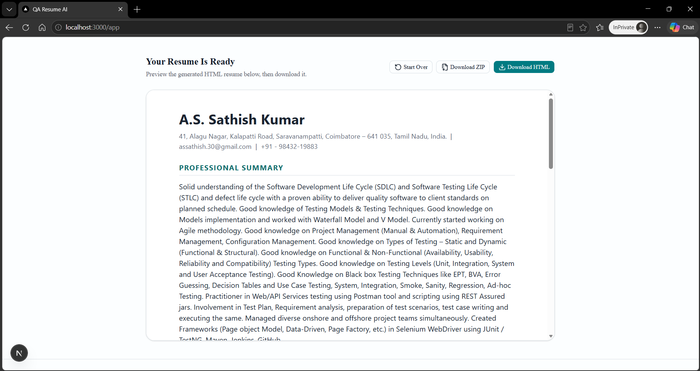

# QA Resume AI

> From QA Experience to Career-Ready Resume — without AI hallucinations.

## Problem Statement

QA professionals often have strong technical experience — automation, API testing,
performance testing, CI/CD — but their resumes frequently fail to communicate that
capability effectively. Meanwhile, generic "AI resume rewriter" tools solve this by
inventing metrics, technologies and achievements the candidate never had, which is
actively dangerous in an interview.

## Solution

**QA Resume AI** is an evidence-grounded resume intelligence platform built specifically
for QA professionals. It extracts verified facts from an uploaded PDF/DOCX resume,
analyzes QA/testing competency coverage against a real skill taxonomy, enhances wording
using a strictly-controlled RICE-POT AI prompt, and runs every generated sentence through
a deterministic Anti-Hallucination validator before it's allowed anywhere near the final
document. The output is a scored, ATS-friendly HTML resume the candidate can download
immediately.

## Key Features

- **PDF & DOCX upload** with client + server validation.
- **Verified fact extraction** — the AI extracts only what's in the source document.
- **QA-specific skill gap detection** across Testing, Automation, API, Performance,
  Programming, CI/CD, Cloud, and Modern QA (AI/LLM testing) categories.
- **RICE-POT controlled AI enhancement** of summary, responsibilities and achievements.
- **Deterministic Anti-Hallucination validator** — every generated claim is checked
  against the source resume for unsupported technologies, metrics, dates and job titles.
  Unsupported claims are rejected and replaced with the original wording, never shipped.
- **ATS / QA Coverage / Impact / Content Quality scoring**, computed deterministically.
- **Deterministic HTML rendering** — the LLM never outputs raw HTML; it only ever
  produces structured, schema-validated JSON that a template renders.
- **Live resume preview** identical to the downloadable file.
- **HTML and ZIP download.**
- **Day / Night mode** with system-preference detection and persistence, independent of
  the generated resume's own fixed styling.

## Why QA Resume AI?

Most "AI resume builder" tools optimize for looking impressive, not for being true. This
project treats the uploaded resume as the single source of truth throughout the entire
pipeline, and makes the validation step a first-class, visible part of the product —
including a dashboard panel that shows exactly which AI-generated claims were rejected
and why.

## Architecture

```text
PDF / DOCX
     ↓
Document Extraction        (pdf-parse / mammoth)
     ↓
Fact Extraction             (LLM, RICE-POT extraction contract)
     ↓
Resume JSON                 (Zod-validated)
     ↓
QA Profile Analysis         (deterministic taxonomy matching)
     ↓
RICE-POT AI Enhancement     (LLM, RICE-POT enhancement contract)
     ↓
Anti-Hallucination Validation (deterministic claim checker)
     ↓
ATS + QA + Impact + Content-Quality Scoring (deterministic)
     ↓
HTML Renderer                (deterministic template, no LLM-authored HTML)
     ↓
Live Preview / Download HTML / Download ZIP
```

## B.L.A.S.T. Framework

- **Blueprint** — the uploaded resume is the north star and the single source of truth;
  the AI may improve wording and structure but never fabricate content.
- **Link** — LLM API (Groq), PDF/DOCX parsers, GitHub, Vercel. No
  unnecessary integrations.
- **Architect** — three layers: architecture docs, the navigation flow
  (Upload → Extract → Validate → Analyze → Enhance → Verify → Score → Render), and
  deterministic tools (extraction, schema validation, fact comparison, scoring, HTML
  generation).
- **Stylize** — professional SaaS interface, Day/Night theme, clear processing states,
  attractive scoring dashboard.
- **Trigger** — GitHub → Vercel → Production.

## RICE-POT AI Framework

Every LLM call in this app is built from all seven components — Role, Instructions,
Context, Examples, Parameters, Output, Tone — defined in
[`src/lib/ai/prompts.ts`](src/lib/ai/prompts.ts). There is no bare "rewrite this resume"
prompt anywhere in the codebase.

## Anti-Hallucination Architecture

```text
Extract Verified Facts → Identify Unknowns → Generate From Facts → Self-Validate → Accept/Reject
```

Implemented in [`src/lib/validation/claim-checker.ts`](src/lib/validation/claim-checker.ts)
and [`src/lib/validation/validate.ts`](src/lib/validation/validate.ts). Every AI-generated
summary sentence, responsibility, and achievement is checked for:

- Unsupported metrics/percentages not present in the source text
- Unsupported dates/years not present in the source text
- Unsupported taxonomy technologies not present in the source text

Anything unsupported is rejected and the original verified wording is used instead — the
final resume is always safe, even if the model tries to embellish.

## QA Gap Detection

Implemented in [`src/lib/qa-analysis.ts`](src/lib/qa-analysis.ts) using the taxonomy in
[`src/lib/qa-taxonomy.ts`](src/lib/qa-taxonomy.ts). The taxonomy is **analysis only** — a
missing skill is reported as missing and is never written into the candidate's resume.

## ATS Scoring

Implemented in [`src/lib/scoring/index.ts`](src/lib/scoring/index.ts): ATS Score (contact
info, standard sections, experience structure, skills structure, keyword coverage,
formatting, readability, consistency), QA Coverage Score, Impact Score, and Content
Quality Score — all computed deterministically from the validated resume JSON.

## Technology Stack

```text
Frontend:   Next.js (App Router), React, TypeScript, Tailwind CSS v4
UI:         shadcn/ui, lucide-react, next-themes
Validation: Zod
Documents:  pdf-parse, mammoth (DOCX)
AI:         Groq (official groq-sdk), model configurable via GROQ_MODEL
Deployment: Vercel
```

## Project Structure

```text
qa-resume-ai/
├── prompts/
│   └── QA-Resume-AI-BLUEPRINT.md
├── src/
│   ├── app/
│   │   ├── page.tsx              # Landing page
│   │   ├── app/page.tsx          # Upload → Processing → Dashboard → Preview flow
│   │   └── api/analyze/route.ts  # Full pipeline API route
│   ├── components/               # UI components (upload, dashboard, preview, theme)
│   │   └── ui/                   # shadcn/ui primitives
│   ├── lib/
│   │   ├── ai/                   # RICE-POT prompts, fact extraction, enhancement
│   │   ├── parser/                # PDF/DOCX text extraction
│   │   ├── validation/            # Anti-hallucination claim checker
│   │   ├── scoring/                # ATS / Impact / Content Quality scoring
│   │   ├── qa-taxonomy.ts
│   │   ├── qa-analysis.ts
│   │   └── render/resume-html.ts  # Deterministic HTML template
│   └── schemas/resume.ts          # Zod Resume JSON schema
└── .env.example
```

## Installation

```bash
npm install
```

## Environment Variables

Copy `.env.example` to `.env.local` and set:

```bash
GROQ_API_KEY=          # required — get one at https://console.groq.com/keys
GROQ_MODEL=            # optional, defaults to openai/gpt-oss-120b
```

`GROQ_API_KEY` is read only on the server (API route handlers and server-only lib
modules) and is never sent to the browser.

## Running Locally

```bash
npm run dev
```

Open [http://localhost:3000](http://localhost:3000).

## Vercel Deployment

1. Push this repository to GitHub.
2. Import it into Vercel ([vercel.com/new](https://vercel.com/new)).
3. In the project's Environment Variables settings, add `GROQ_API_KEY` (and optionally
   `GROQ_MODEL`). Without `GROQ_API_KEY` the `/api/analyze` route returns a clear
   503 error instead of crashing.
4. Deploy. The app is a standard Next.js App Router project — no additional
   configuration is needed.

## Demo

1. Upload a QA resume (PDF or DOCX).
2. Watch the processing checklist run through extraction, QA analysis, enhancement,
   validation and scoring.
3. Review the dashboard: ATS / QA Coverage / Impact / Content Quality scores, AI
   findings, and the Anti-Hallucination Check panel.
4. Open the resume preview and download the HTML (or ZIP with the resume JSON included).

## Screenshots

### Landing Page



### Uploading a Resume



### Resume Analysis in Progress



### Resume Review Report (ATS / QA Coverage / Impact / Content Quality)



### Downloading the Enhanced Resume



## Future Roadmap

- Authentication and saved resume history
- Multiple resume templates
- Cover letter generation
- Interview preparation chatbot
- LinkedIn / job portal integrations

## License

MIT
